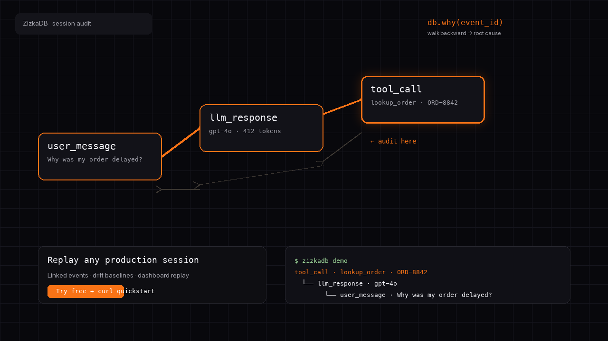
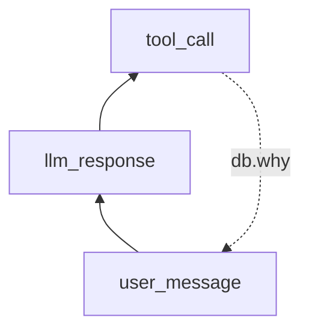

<div align="center">

# ZizkaDB

**Don't observe — audit your AI agent.**

Open-source **audit trail for AI agents** — causal lineage, session replay, and drift detection for **LangChain**, **CrewAI**, **Cursor**, and any agent stack. Trace **why** a decision happened instead of grepping scattered logs.

**Free · self-host · no signup required**

[](https://github.com/Zizka-ai/ZizkaDB/actions/workflows/ci.yml)
[](LICENSE)
[](https://github.com/Zizka-ai/ZizkaDB/releases)
[](https://pypi.org/project/zizkadb-sdk/0.2.7/)
[](https://www.npmjs.com/package/zizkadb-sdk/v/0.2.7)
[](https://pypi.org/project/zizkadb-langchain/0.1.2/)
[](https://pypi.org/project/zizkadb-crewai/0.1.2/)
[](https://pypi.org/project/zizkadb-mcp/0.1.6/)

**[Try free ↓](#open-source-self-host)** · **[START_HERE.md](START_HERE.md)** · **[CONNECT.md](CONNECT.md)** · **[Pro ↓](#pro-managed-cloud)** · **[Docs](https://db.zizka.ai/docs)**

</div>

<p align="center">
  <a href="#open-source-self-host">
    
  </a>
</p>

<p align="center">
  <a href="http://localhost:3001/login">
    
  </a>
  <br/>
  <sub><strong>Live product UI</strong> after <code>quickstart</code> — replay sessions, drift baselines, fix suggestions</sub>
</p>

- **Causal chains, not log dumps.** Link steps with `parent_id`, then walk backward with `why()` — root cause in one call, not manual correlation.
- **Not a trace UI.** Built to **audit** production agents: replay sessions, compare baselines, prove what changed after a deploy.
- **Local-first & free.** OSS stack on your machine — Docker quickstart, no signup, no API key on `localhost`.

<a id="start-in-60-seconds-no-repo-clone"></a>

## See it in action

**Get started (2 minutes)** — requires [Docker](https://docs.docker.com/get-docker/):

```bash
curl -fsSL https://raw.githubusercontent.com/Zizka-ai/ZizkaDB/main/scripts/quickstart-remote.sh | bash
```

Real output from `zizkadb demo` (support-bot order delay):

```text
$ zizkadb demo
→ ZizkaDB @ http://localhost:8000

Logged chain. Walking back with db.why():

tool_call · lookup_order · ORD-8842
  └── llm_response · gpt-4o
        └── user_message · Why was my order delayed?
  → zizkadb why <event_id>    # printed after each db.log() on localhost

✓ Done — open the dashboard to explore this agent:
  http://localhost:3001/dashboard/activity?agent=support-bot
  CLI:  zizkadb why <event_id>
```

**Works with:** Python · TypeScript · LangChain · CrewAI · Cursor / Claude MCP · REST · any HTTP client

---

## What you get

| Capability | What you get |
|---|---|
| **Causal lineage** | `db.why(event_id)` walks from any step back to the user message |
| **Session replay** | Full agent run in the dashboard — Activity, Behavior, Reports |
| **Drift baselines** | `db.baseline(agent)` flags when answers change vs past sessions |
| **Time travel** | `db.at(agent, timestamp)` — what the agent knew at decision time |
| **Semantic search** | Plain-English search over agent history (`db.search()`) |
| **Editor integration** | MCP tools in Cursor — audit from chat without rewriting your app |

## Observe vs audit

| | Typical observability / logs | ZizkaDB |
|---|---|---|
| **Question** | What lines mention `lookup_order`? | **Why** did the agent call `lookup_order`? |
| **Structure** | Flat, unrelated events | Linked chain via `parent_id` |
| **After a bad answer** | Grep and guess | Replay session + walk `why()` |
| **After prompt deploy** | Hope someone notices | Baseline / drift alert |
| **Proof for teams** | Screenshots of log noise | Shareable audit trail in dashboard |



> **New here?** You do **not** need to understand this whole repo.  
> Copy the command above → see an audit trail in your terminal → open the dashboard.  
> Managed cloud (Pro / Team) is optional — **[jump to OSS details ↓](#open-source-self-host)**

<br/>

---

## Pick your path

| | **Open Source** | **Pro** | **Team** |
| :--- | :--- | :--- | :--- |
| **Best for** | Self-hosters & contributors | Solo devs & early prod | Teams with multiple agents |
| **Price** | **Free forever (AGPL)** | €29 / month | €69 / month |
| **Hosting** | Your machine / VPC | [db.zizka.ai](https://db.zizka.ai) | [db.zizka.ai](https://db.zizka.ai) |
| **Events / month** | Unlimited (your infra) | 50k† | 100k† |
| **Active API keys** | Unlimited | 2 | 5 |
| **Dashboard** | Activity · Behavior · Reports · Suggestions | Same + **Fleet** (managed) | Same + **Fleet** + priority support |
| **Support** | Community | Email | Priority |
| **Jump to** | **[Start free ↓](#open-source-self-host)** | [4 steps ↓](#pro-managed-cloud) | [4 steps ↓](#team-managed-cloud) |

> **Enterprise VPC?** Single-tenant deploy, commercial license → [db.zizka.ai/enterprise](https://db.zizka.ai/enterprise)

> † Event caps are **plan targets** on managed cloud; **not enforced** in the API yet. **Active API key** caps apply when `API_KEY_LIMITS_ENFORCED=true`. Details: [docs/README.md](docs/README.md#plan-limits-honest).

> This repo is the **open-source product runtime** (API, dashboard, SDKs, MCP). Managed operator tools live in a private repo; all product links point here.

---

## Open Source (self-host)

**Free · AGPL-3.0 · No signup · Your infrastructure**

| Step | What you get |
| :---: | :--- |
| **① What it is** | ZizkaDB stores every agent step as a **linked event** — not scattered logs. Trace decisions with **`why()`**, rewind with **`at()`**, search history in plain English, and catch **behavioral drift** before users notice. You run the full stack: API + dashboard + SDKs. |
| **② How to integrate** | Run locally: `curl -fsSL …/quickstart-remote.sh \| bash` then `pip install zizkadb-sdk` (or TS / MCP / REST). Link events with `parent_id` so `why()` can walk the chain. → **[Full connect guide](CONNECT.md)** |
| **③ Documentation** | [START_HERE.md](START_HERE.md) · [CONNECT.md](CONNECT.md) · [worked example](worked/01-support-order-delay/) · [Examples](examples/) · [Self-hosting](https://github.com/Zizka-ai/ZizkaDB/wiki/Self-Hosting) |
| **④ Live dashboard** | **[Activity → support-bot](http://localhost:3001/dashboard/activity?agent=support-bot)** (after login gate). Log from SDK → refresh → see sessions live. |

**Quickstart** — ~2 min cached · ~5–10 min first Docker image pull

Already ran the command above? Skip to **[Connect your agent](#connect-your-agent-3-lines)**.

<details>
<summary>Prerequisites</summary>

| Requirement | Minimum | Check |
|---|---|---|
| Docker | Desktop or Engine | `docker info` |
| Python | 3.10+ (for demo CLI) | `python3 --version` |
| Disk | ~2 GB for images | first pull only |

</details>

**Run the demo again anytime:**

```bash
pip install zizkadb-sdk
zizkadb demo
```

**Story behind the demo:** [worked/01-support-order-delay](worked/01-support-order-delay/) — support-bot, order delay, full `parent_id` chain.

<a id="connect-your-agent-3-lines"></a>

**Connect your agent (3 lines):**

```python
import asyncio
from zizkadb import ZizkaDB

async def main():
    async with ZizkaDB(host="http://localhost:8000") as db:
        user = await db.log(agent="my-bot", event="user_message", data={"text": "Why is my order late?"})
        tool = await db.log(agent="my-bot", event="tool_call", data={"tool": "lookup_order"}, parent_id=user.event_id)
        (await db.why(tool.event_id)).print()

asyncio.run(main())
```

<p align="center">
  
</p>

<p align="center">
  <sub>Audit from Cursor · same stack locally or on <a href="https://db.zizka.ai">managed cloud</a> · <a href="worked/01-support-order-delay/">worked example →</a></sub>
</p>

<details>
<summary>Other local install options</summary>

**Already cloned this repo:**

```bash
bash scripts/quickstart.sh
```

**Stack only (no demo):**

```bash
bash scripts/setup-local.sh
```

**No Docker?** See [Self-hosting wiki](https://github.com/Zizka-ai/ZizkaDB/wiki/Self-Hosting) or [Pro (managed cloud)](#pro-managed-cloud) below.

</details>

---

## Pro (managed cloud)

**Optional · Hosted for you · No Docker to maintain**

| Step | What you get |
| :---: | :--- |
| **① What it is** | Same engine, **hosted on [db.zizka.ai](https://db.zizka.ai)**. Replay sessions and trace causal chains without running your own databases. **vs OSS:** zero infra · instant API keys · **Fleet** tab on managed cloud. |
| **② How to integrate** | [Sign up →](https://db.zizka.ai/signup?plan=pro) · create agent · copy API key · `pip install zizkadb-sdk` · log with `api_key="zizkadb_live_..."`. Also: npm, MCP, REST. → **[CONNECT.md](CONNECT.md)** |
| **③ Documentation** | [db.zizka.ai/docs](https://db.zizka.ai/docs) · [Swagger](https://db.zizka.ai/swagger) · [Community](https://db.zizka.ai/community) · **50k events/mo† · 2 API keys · email support** |
| **④ Live dashboard** | **[db.zizka.ai/dashboard](https://db.zizka.ai/dashboard)** — sign up, log from SDK, sessions appear in seconds. Same UI as self-host, always online. |

```python
async with ZizkaDB(api_key="zizkadb_live_...") as db:
    await db.log(agent="support-bot", event="user_message", data={"text": "Hello"})
```

<p align="center">
  <a href="https://db.zizka.ai/dashboard">
    
  </a>
  <br/>
  <a href="https://db.zizka.ai/signup?plan=pro"><strong>Get started with Pro →</strong></a>
</p>

---

## Team (managed cloud)

**Optional · Multiple agents in production**

| Step | What you get |
| :---: | :--- |
| **① What it is** | Everything in **Pro**, with room to grow. **vs Pro:** 100k events† (vs 50k) · 5 active API keys (vs 2) · **priority support** · built for multi-agent ops with **Fleet** ranking. |
| **② How to integrate** | [Sign up for Team →](https://db.zizka.ai/signup?plan=team) · one agent per service · consistent `session_id` per conversation. → **[Multi-agent wiki](https://github.com/Zizka-ai/ZizkaDB/wiki/Multi-Agent-Apps)** |
| **③ Documentation** | [Plan picker](https://db.zizka.ai/signup/plan) · [Docs](https://db.zizka.ai/docs) · [Production wiki](https://github.com/Zizka-ai/ZizkaDB/wiki/Production-Deployment) · **100k events/mo† · 5 API keys · priority support** |
| **④ Live dashboard** | **[db.zizka.ai/dashboard](https://db.zizka.ai/dashboard)** — switch agents, compare baselines, Fleet ranking across your workspace. |

```typescript
const db = new ZizkaDB({ apiKey: process.env.ZIZKADB_API_KEY! })
await db.log({ agent: 'sales-bot', event: 'tool_call', data: { tool: 'crm_lookup' }, parentId: prev.eventId })
```

<p align="center">
  <a href="https://db.zizka.ai/signup?plan=team">
    
  </a>
  <br/>
  <a href="https://db.zizka.ai/signup?plan=team"><strong>Get started with Team →</strong></a>
</p>

### Tests

Core unit tests plus the SDK and MCP package tests do not require a running ZizkaDB stack:

```bash
# Core tests
(cd core && python -m pip install -r requirements.txt -r requirements-dev.txt && python -m pytest tests -q)

# Python SDK tests
(cd sdk/python && python -m pip install -e '.[dev]' && python -m pytest tests -q)

# MCP tests
(cd mcp && python -m pip install -e '.[dev]' && python -m pytest tests -q)

# TypeScript SDK tests
(cd sdk/typescript && npm ci && npm test)
```

---

## Compare capabilities

| Capability | OSS | Pro | Team |
| --- | :---: | :---: | :---: |
| `db.log()` · `db.why()` · `db.at()` | ✓ | ✓ | ✓ |
| Semantic search & drift baselines | ✓ | ✓ | ✓ |
| Activity · Behavior · Reports · Suggestions | ✓ | ✓ | ✓ |
| **Fleet** tab (managed cloud) | — | ✓ | ✓ |
| Self-host / AGPL | ✓ | — | — |
| Managed hosting | — | ✓ | ✓ |
| 50k events / month† | — | ✓ | — |
| 100k events / month† | — | — | ✓ |
| 2 active API keys | — | ✓ | — |
| 5 active API keys | — | — | ✓ |
| Priority support | — | — | ✓ |
| Enterprise VPC | [Contact →](https://db.zizka.ai/enterprise) | | |

---

## Integrations

**Current releases:** PyPI `zizkadb-sdk` **0.2.7** · npm `zizkadb-sdk` **0.2.7** · `zizkadb-mcp` **0.1.6** · `zizkadb-langchain` **0.1.2** · `zizkadb-crewai` **0.1.2**

| Python | TypeScript | LangChain | CrewAI | MCP (Cursor) | REST |
| :---: | :---: | :---: | :---: | :---: | :---: |
| [`pip install zizkadb-sdk`](https://pypi.org/project/zizkadb-sdk/) | [`npm i zizkadb-sdk`](https://www.npmjs.com/package/zizkadb-sdk) | [Guide →](CONNECT.md#langchain) | [Guide →](CONNECT.md#crewai) | `uvx zizkadb-mcp` | [Swagger →](https://db.zizka.ai/swagger) |

**Any framework:** [docs/integrate/any-agent.md](docs/integrate/any-agent.md) · **LangGraph / others:** [docs/integrate/frameworks.md](docs/integrate/frameworks.md)

<p align="center">
  
  &nbsp;
  
</p>

<details>
<summary><strong>All SDK examples (Python · TypeScript · LangChain · CrewAI · MCP · REST)</strong></summary>

See **[CONNECT.md](CONNECT.md)** for full copy-paste examples.

```bash
pip install zizkadb-sdk
npm install zizkadb-sdk
uvx zizkadb-mcp
zizkadb init my-agent --template basic
```

</details>

---

## Core API

| Function | What it does |
| --- | --- |
| `db.log()` | Record any agent step; use `parent_id` for causal links |
| `db.why()` | Walk backward from any event to root cause |
| `db.search()` | Semantic search over agent history |
| `db.at()` | Reconstruct state at a point in time |
| `db.baseline()` | Detect behavioral drift |
| `db.context_for()` | Inject relevant past events into prompts |
| `db.forget()` | GDPR erasure by metadata filter |

---

## Worked examples

| Scenario | Command / link | What you prove |
|---|---|---|
| Support-bot order delay | `zizkadb demo` | 3-step causal chain + dashboard session |
| Step-by-step walkthrough | [worked/01-support-order-delay](worked/01-support-order-delay/) | Same story with source code |
| LangChain agent | [examples/langchain-agent](examples/langchain-agent/) | Auto-log every chain step |
| Cursor MCP | [examples/mcp-cursor](examples/mcp-cursor/) | Audit from the editor |

---

## FAQ

<details>
<summary><strong>Do I need to clone this repo?</strong></summary>

No. `curl … quickstart-remote.sh | bash` downloads a few config files and pulls Docker images — no full clone required.

</details>

<details>
<summary><strong>Do I need an API key for local dev?</strong></summary>

No. The local stack uses a built-in dev key on `http://localhost:8000`. Open the dashboard at [localhost:3001/login](http://localhost:3001/login) with no signup.

</details>

<details>
<summary><strong>How is this different from LangSmith / Langfuse?</strong></summary>

Those tools **observe** traces and spans. ZizkaDB is built to **audit** agent behavior on **your Postgres**: explicit `parent_id` chains, `why()` in one call, session replay, drift baselines, and time-travel state — optimized for *why did production behavior change?* Self-host the full stack under AGPL with no trace billing.

| | Span tracers (Langfuse, etc.) | ZizkaDB |
|---|---|---|
| Causal proof | Infer from span tree | `db.why(event_id)` walks `parent_id` |
| Agent state at T | — | `db.at(agent, timestamp)` |
| Self-hosted audit DB | Partial / trace store | Full product (API + dashboard) |

See [wiki comparisons](https://github.com/Zizka-ai/ZizkaDB/wiki).

</details>

<details>
<summary><strong>What are the <code>→ zizkadb why</code> lines after <code>db.log()</code>?</strong></summary>

On **localhost**, the Python SDK prints a CLI hint after each successful log so you can inspect causality immediately. Disable with `export ZIZKADB_QUIET=1`. Force on cloud with `export ZIZKADB_LOG_HINTS=1`.

</details>

<details>
<summary><strong><code>zizkadb demo</code> fails — connection refused?</strong></summary>

Start the stack first: `curl -fsSL …/quickstart-remote.sh | bash` or `bash scripts/setup-local.sh`. Check API health: `curl http://localhost:8000/health`.

</details>

---

## Community & license

| Resource | Link |
| --- | --- |
| **Start here (60s path)** | [START_HERE.md](START_HERE.md) |
| Connect guide | [CONNECT.md](CONNECT.md) |
| Worked example | [worked/01-support-order-delay](worked/01-support-order-delay/) |
| Documentation index | [docs/README.md](docs/README.md) |
| Integrate any agent | [docs/integrate/](docs/integrate/) |
| Issues | [GitHub Issues](https://github.com/Zizka-ai/ZizkaDB/issues) |
| Discussions | [GitHub Discussions](https://github.com/Zizka-ai/ZizkaDB/discussions) |
| Forum | [db.zizka.ai/community](https://db.zizka.ai/community) |
| Contributing | [CONTRIBUTING.md](CONTRIBUTING.md) |
| Security | [SECURITY.md](SECURITY.md) |
| License | API & dashboard [AGPL-3.0](LICENSE) · MCP [MIT](mcp/LICENSE) |

<p align="center">
  <a href="https://mseep.ai/app/zizka-ai-zizkadb">
    
  </a>
  &nbsp;&nbsp;
  <a href="https://mseep.ai/app/c3411d91-26eb-49df-a8e3-7ef5914a48dd">
    
  </a>
</p>

Disable telemetry: `export ZIZKADB_TELEMETRY=false`
